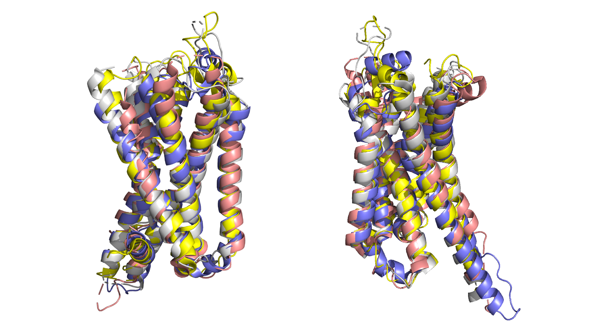
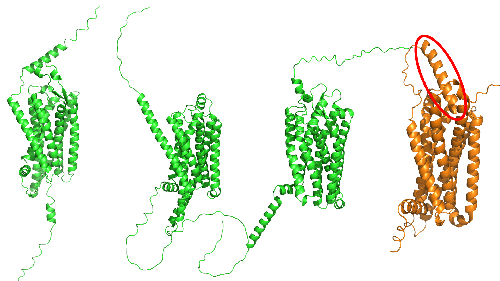

A recent paper published in the Nature Journal, *Acta Pharmacologica Sinica* titled *AlphaFold2 versus experimental structures: evaluation on G protein-coupled receptors* reignited my interest in AlphaFold2, *DeepMind's* foray into neural-net driven prediction of protein structures. Xin-heng He and colleagues take the, in-retrospect, bleedingly obvious steps to compare AlphaFold predicted structures (available from the [EBI repository](https://alphafold.ebi.ac.uk/), no API access required) with experimentally generated structure's in the literature.

By-and-large, the study finds that for the 'rigid' regions of a GPCR (i.e. the transmembrane domains) the prediction is quite good. Comparatively, predictions of the intracellular and extracellular faces differ significantly from experimental structures.

To me, this is not particularly surprising - I am not by any means intimately familiar with AlphaFold's methodology for predicting structures but a quick peruse of the [AlphaFold paper](https://doi.org/10.1038/s41586-021-03819-2) indicates that the algorithm is trained on structures in the PDB database. Thus, the neural net is not really simulating individual amino acid residues and computing how they fit together, it's more like identifying what other, experimentally-derived, protein structures are similar to the target sequence and working backwards. One can imagine a scenario where the algorithm is generating a GPCR, Receptor A: First it fetches Receptor A's amino acid sequence, notices that there's a big chunk of the sequence (the transmembrane domain) that is highly homogenous with an entire class of proteins (The GPCR family) and then observes that class of proteins all are highly homogenous with one another in a given region (the transmembrane domain), finally the algorithm copies that homologous region and substitutes in Receptor A's residues where needed. Comparatively, for regions that are not quite as homologous such as the extracellular and intracellular surfaces the algorithm has to work harder and 'make up' more. This results in relatively poor prediction of such domains, something that He and colleagues illustrate when they find that only 25% of the predicted GPCR structures possess an orthosteric ligand binding site with the correct residues. Full *in silico* structure based drug design isn't here yet!

---

Despite all of this, even for the 'bad' regions AlphaFold's predictions are nothing short of impressive. Determining the structure of the N- and C-terminus of GPCRs via crystallisation or cryo-EM is exceedingly difficult due to their non-rigidity. As a result, GPCR structures in the PDB usually have these regions truncated and AlphaFold has to more-or-less model these regions from scratch. Of the structures of the Melanocortin 4 Receptor in the PDB, not one has the N-terminus present. The AlphaFold Melanocortin 4 Receptor possesses an intact N-terminus. Moreover, this N-terminus appears to jut toward the receptor's orthosteric binding pocket - something that has been previously suggested but never demonstrated with structural data. This N-terminus conformation does not seem to be something that AlphaFold does for all GPCRs either as neither the NPY1 receptor, GHSR1a nor a handful of other receptors I looked at possessed a similar N-terminus. Given the poor prediction of orthosteric binding pockets it definitely cannot be concluded that MC4R's N-terminus does indeed stick into the receptor like this but given that biological data has suggested so previously, it is very impressive that AlphaFold has predicted an apparently biologically-consistent structure in the absence of any 'training' data.

